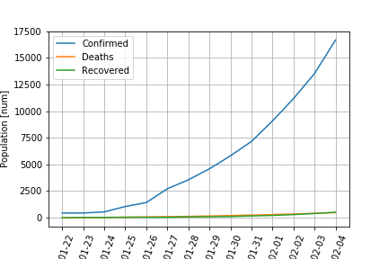
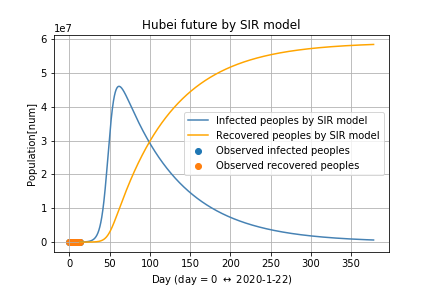

Anlysis of 2019-nCoV disease
===

このコードでは，新型コロナウィルス（2019-nCoV）の数理モデル化と予測を行います．

## 詳細 Description
このコードは， 現在の伝染病をSIRで記述し，新型コロナウィルスの将来を予測します．

## データの説明: Data Description

 - ``data/2019_nCoV_data.csv`` : 
新型コロナウィルスの感染，死者と回復した人数のデータ． 
データは[こちら](https://www.kaggle.com/sudalairajkumar/novel-corona-virus-2019-dataset/data)から引用しています．

 - ``data/2017_China_data.csv`` : 
2017年の中国の人工データ．[こちら](https://en.wikipedia.org/wiki/List_of_Chinese_administrative_divisions_by_population)の人口統計データを用いています．

## プログラムの説明 : Code Description
- ``data_check.ipynb`` : テスト用
- ``Hubei_model.ipynb`` : 武漢の新型コロナウィルスの結果をSIRモデルで近似し，将来を予測する．

↑武漢の新型コロナウィルスの時間変化

↑SIRモデルで近似した結果．
ただし，recovered people =  回復した人+死亡した人

↑SIRモデルによる10日後までの予測結果．

↑SIRモデルによる一年後までの予測結果．

## その他のファイル : the other files

- ``blog/*`` : ブログに乗せる文書をおいてます．

## 謝辞 Acknowledgements
データをまとめていただいた方に感謝いたします．
また，新コロナウィルスと戦っているすべての方々に，幸あらんことを， 

## ライセンス License
あまり仕組みに詳しくないですが，公開時に引用元をかいていただければ，好きに使って構いません．
一方で，数理モデルによる予測は注意点もあるので，報道などで広範囲に予測結果を広げる際は，ひと声かけてくれる助かります．

## Auther

岡本有司 yuji.0001@gmail.com

気軽に質問ください.

