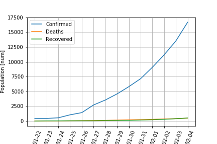
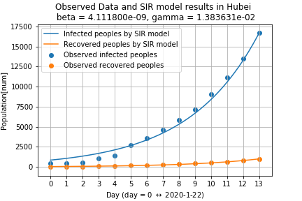
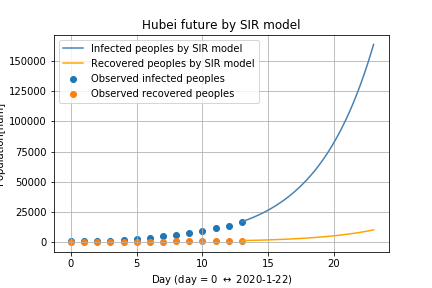
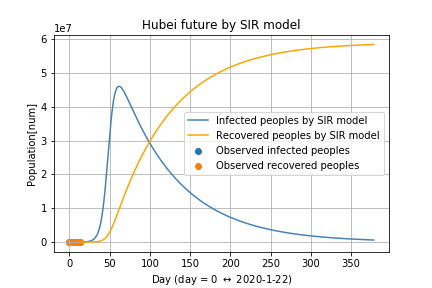

SIRモデルを使って新型肺炎の感染を予測してみた:武漢編
===

最近，新型肺炎が流行っていますね．
以前にSIRモデルという感染症の数理モデルを使った研究をしていたので，新型肺炎のモデルに当てはめてみました．
数理モデルを使うと，感染症の未来を予測できます．

今回は，発生の中心である ***武漢*** に注目して，感染症のモデル化と感染症の未来を予測します．

### keyword
疫学, SIR model, nCoV-2019, 新型肺炎, 新型コロナウィルス

## SIRモデル
SIRモデルは，感染した人数の推移を微分方程式として表したモデルです（[Wikipedia](https://ja.wikipedia.org/wiki/SIRモデル)でもわかりやすく解析されています）． 
SIRモデルでは，感染症に対して人は3つの状態を取ると考えられます．

1. 感染する可能性がある人 : S
2. 感染している人：I
3. 感染から治って免疫を獲得した人，または死亡した人 : R

時刻$t$における感染する可能性のある人，感染している人と感染から治った人をそれぞれ$S(t), I(t)$と$R(t)$表記すると，SIRモデルは，

$$
\dot{S}(t) = -\beta S(t)I(t),\\
\dot{I}(t) = \beta S(t)I(t) - \gamma I(t)\\
\dot{R}(t) = \gamma I(t)
$$

と記述されます．
ここで，$\beta$は感染率を表し，$\gamma$は回復率(+死亡率)を表しています．
感染者の増え方は，感染率$\beta$，感染する可能性がある人$S(t)$と感染している人$I(t)$に比例します．

死亡した人も感染を引き起こさないので，感染から治った人と同一視することに注意してください．

ここで， 
$$
S(t) + I(t) + R(t) = N
$$
は一定となり，その地域の人口と一致します．
今回は，武漢の人口を使います．

武漢における新型肝炎の感染データをつかって，感染率$\beta$と回復率$\gamma$を学習し，武漢の未来を予測します．
## 使ったデータ

感染データはkaggleに公開されている[こちら](https://www.kaggle.com/sudalairajkumar/novel-corona-virus-2019-dataset/data)から引用しています．
また，武漢の人口データは，[こちら](https://en.wikipedia.org/wiki/List_of_Chinese_administrative_divisions_by_population)のに記述されている2017年の人口統計データを用いています．

## SIRモデルを使ったパラメーターの学習

武漢における，2020年1月22日から2月4日までの感染の推移は，以下のようになります．

青線が感染者数，オレンジ線が死者数，緑線が回復した人数です．
回復した人数と死者数がだいたい同じであることは，少しおかしいかな？と思います．

このデータを表現できるように，SIRモデルでフィッティングしてみました．

Recovered peopleは回復した人と死者数の和としています．
また，青点が実際に観測されている感染者数，青線がSIRモデルで近似した結果です．
オレンジ点とオレンジ線は回復した人数の実測値と予測値です．

十分に近似できていそうです．

## 武漢の感染の未来を予測

十分に近似できていそうなので，学習したパラメータを使って，武漢の感染の未来を予測してみました．

次の図が，2月4日から10日間の予測になります．

点が実測値，線が予測値です．
SIRモデルよれば，まだまだ増加するようです．

次が2月4日から一年間の予測になります．

感染が全然止まらいようです．

## 考察

- SIRモデルを用いて武漢における新型肺炎の感染の拡大を予測してみましたが，拡大が止まらないという予測結果になりました．
- 武漢において回復した人数が正確に計量されていないことが原因だと思われます．
- 他のデータを用いて，回復率$\beta$を正確に測定できれば，より良い予測ができると考えられます．
- 次は，交通量をもとに，中国全土の感染の広がりをモデル化しようと思います．

## コード

https://github.com/yuji0001/202002nCoV_analysis